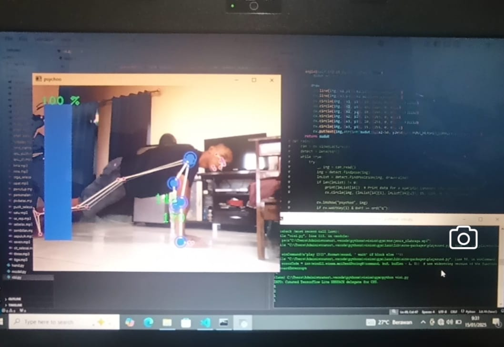

<h1 align="center"> PSYCHO-GYM </h1>

# MENDETEKSI GERAKAN PUSH UP DAN HITUNG OTOMATIS 
-program ini dibuat sebagai praktek pembelajaran opencv dan mediapipe saya. 
-menggunakan hand dan pose landmarks dari mediapipe untuk mendeteksi tubuh 
-menggunakan file audio external agar tidak terlalu kompleks 

# CARA PENGOPERASIAN :
-tunjukkan 5 jari tangan untuk memulai program  
-tunjukkan 2 jari tangan untuk memilih gerakan push up 
-tunjukkan satu jari tangan untuk mendeklarasikan 10 repetisi 

# CARA MENGGUNAKAN :
-INSTALL PYTHON 3.8 || 3.10 
-INSTALL SEMUA YANG ADA DI [REQUIREMENTS](requirements.txt) 
-FILE [VISI](visi.py) ADALAH FILE PROGRAM UTAMA  

## © 2025 Rivaldi Fadlan
All rights reserved. Unauthorized use, copying, modification, or distribution without permission is strictly prohibited.
